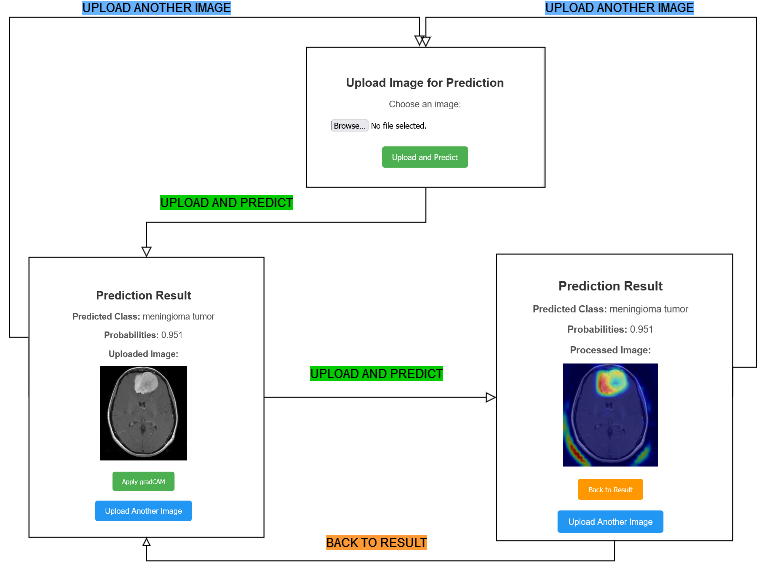
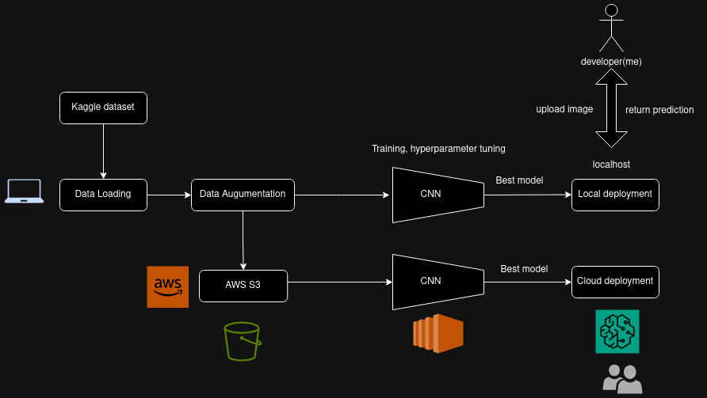

# MRIMaster: AI-supported medical imaging classifier

## Installation
Docker hub
PYPI

## 


## How to Use The Best Model Locally




## Training and Deployment (Local and Cloud Solution)



## Structure
```
/root
├── app.py
├── model_to_deploy.pt
├── src
├── templates
│   └── index.html
│   └── result.html
│   └── apply_gradcam.html
├── static
├── data
│   └── raw_data/
│   └── processed_data/
│── .env
``` 

## Experiments to run
- [ ] Augmentation (with or without augmentation)
- [ ] Hyperparameters (learning_rate, batch_size, etc)
- [ ] The number of filters for each conv2d layer

## Features to add (in order)
- [ ] Enable switching between models for different classification tasks
- [ ] Build data pipeline for additional datasets beyond Kaggle, e.g., [TCIA API](https://wiki.cancerimagingarchive.net/display/Public/TCIA+Programmatic+Interface+REST+API+Guides)
- [ ] Add object detection for identifying and measuring tumor size
