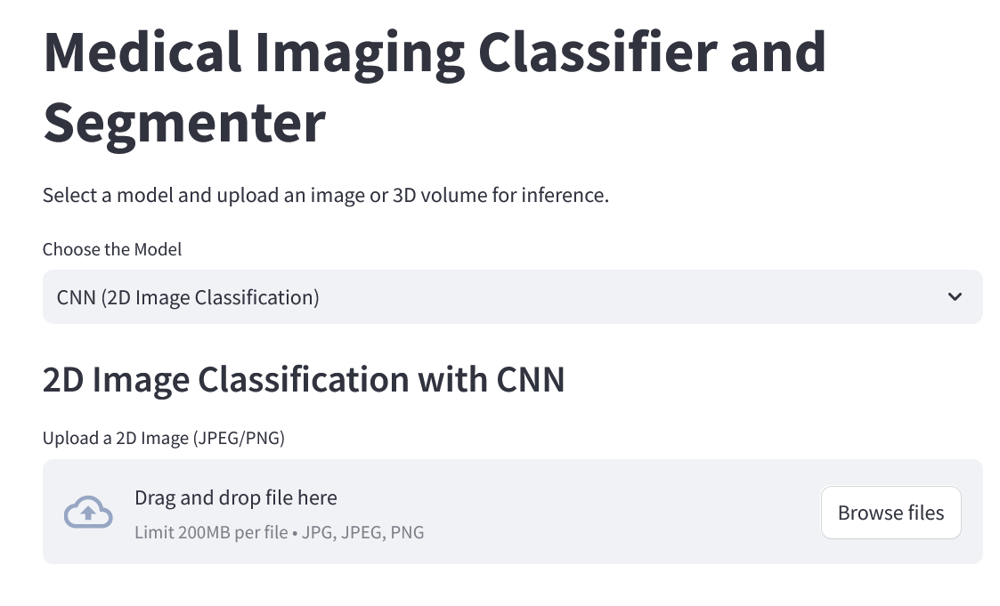
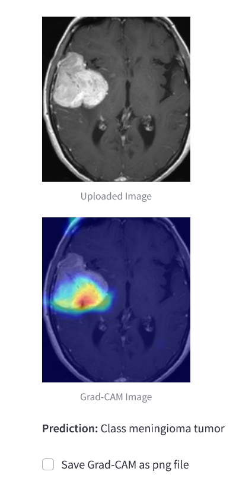
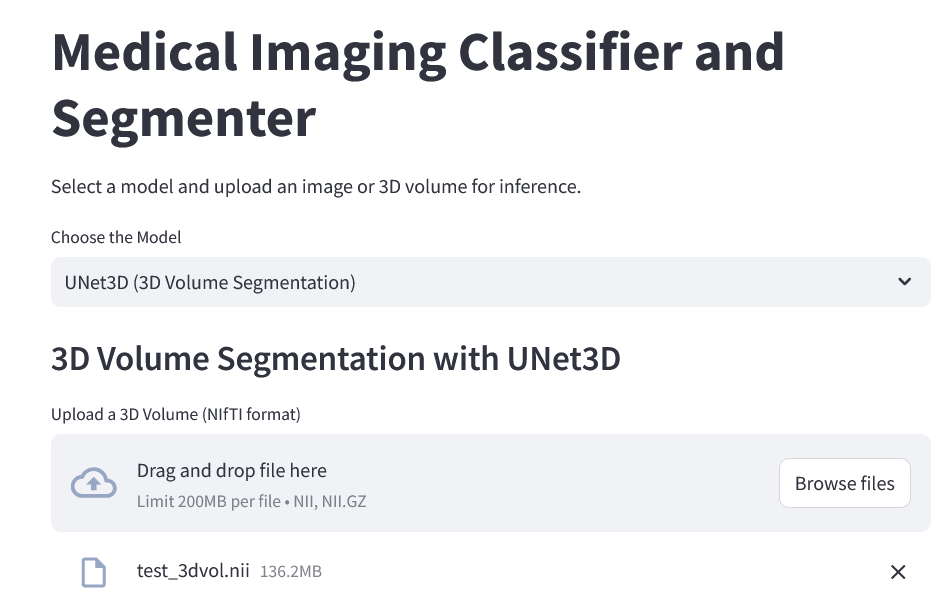
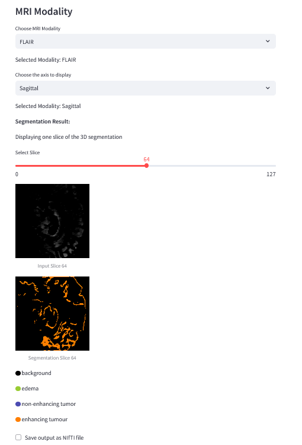

## MRIMaster: AI-powered medical imaging classifier and segmenter
[](https://opensource.org/licenses/MIT)
### Table of Contents
<!-- Buttons -->
<p>
  <a href="#for-app-users" style="text-decoration: none;">
    <button style="background-color: #b6e2d3; color: white; padding: 10px 20px; border: none; border-radius: 5px; cursor: pointer;">For App Users</button>
  </a>

[How to run the app](#how-to-run-the-app)
[Take a look at the app](#take-a-look-at-the-app)

  <a href="#for-developers" style="text-decoration: none;">
    <button style="background-color: #ffa384; color: white; padding: 10px 20px; border: none; border-radius: 5px; cursor: pointer;">For Developers</button>
  </a>
</p>

[Datasets](#datasets)
[Data Preprocessing](#data-preprocessing)
[Model](#model)
[Training](#training)
[Validation](#validation)
[Inference](#inference)
[Configuration](#configuration)
[Disclaimer](#disclaimer)
[Features to add](#features-to-add)

## For App Users

### How to run the app

**Clone this repo** 

```cmd
git clone git@github.com:lixianphys/MRImaster.git
cd mrimaster
git checkout published
mkdir models
```
**Download model weights**
[deployed_models/cnn_model.pt+unet_model.pt](
https://drive.google.com/drive/folders/1jq7sQmRFvcLYLx71oBgekZpstMblgdH_?usp=drive_link)

Place this `deployed_models` under `models`

**Setup Environment (Linux or WSL)**
```cmd
python -m venv venv
source venv/bin/activate
pip install -r requirements.txt
```
**Launch the App**
```cmd
streamlit run app.py
```

### Take a look at the app
**cnn model (Prediction+Grad-CAM)**
|  |  |
|-------------------------|------------------------|

**unet3d model (Slice,Modality,Segmentation)**
|  |  |
|-------------------------|------------------------|


---
## For developers
### Datasets 
**Brats dataset - Task01 Brain Tumor (unet3d model)**
[Brats2017 (Gliomas segmentation tumour and oedema in on brain images)]("https://www.med.upenn.edu/sbia/brats2017.html")
This 4D image dataset contains brain MR images together with segmentation masks. All images and masks are provided in `.nii.gz` format with 4 channels (FLAIR,T1w, t1gd and T2w) per image. Masks are categorical with four classes: background, edema, non-enhancing tumor and enhancing tumour.

**Kaggle dataset - brain-tumor-classification-mri (cnn model)**
[This brain-tumor-classification-mri dataset]("https://www.kaggle.com/datasets/sartajbhuvaji/brain-tumor-classification-mri") contains Training and Testing folders. Each folder has four subfolders, which contain MRIs of respective tumor classes (Glioma, Meningioma, Pituitary and No Tumor).

### Data Preprocessing
It is rather straightforward to download medium-sized, well-structured Kaggle dataset by using `src.preprocess.kaggledata.KaggleDataPipe`. While dealing with a large volume of `nii.gz` or `nii` files (a single file can exceed 100 Mb), it is worth considering about reducing the loading time during each epoch of training. For this consideration, please have a look at the design of `src.preprocess.nifti.LazyLoadingNiftiDataset` about caching and reloading. Differently, for evaluation and inference, this caching mechanism will slow down the process, we simply turn to a normal loading process encapsulated in `src.preprocess.nifti.NormalLoadingNiftiDataset`.

### Model
For adapting models to more specific uses, some model hyperparameters, such as number of classes, can be modified directly at the `model` block in config files `config/cnn.yaml` and `config/unet.yaml`. Below are the default models for each type:
- **cnn model**: 4 layers of convoluational neural network for classification task. Input is in shape of (C=3, H=256, W=256). Output is the prediction of 4 classes.
- **unet3d model**: Unet shape for segmentation task. Input is in shape of (bach_size, C=4, H=128, W=128, D=128).

### Training
Edit the `train` block in config files.
```
python scripts/train_model.py --model [cnn or unet3d] --config [path_to_config_file] --use_mlflow
```
This command-line together with the config files for training different models (`cnng.yaml` and `unet.ymal`) provides a easy-to-go and flexible access to training your model. 

Additionally, adding `--use_mlflow` ensures logging the experiment, parameters, metrics and artifacts into a MLflow server. Make sure that you have already spinned up one like this: 
```
mlflow server --backend-store-uri sqlite:///mlflow.db --default-artifact-root ./mlruns --host 0.0.0.0 --port 5000
```

### Validation
Evaluate the trained model with a fresh (not seen by the model yet) dataset can quickly provide a good feeling about how good the model can perform in real-world settings. After evaluation, a report in `.md` format will be generated, summarizing the performance (Confusion Matrix, Classification Report, IOU score and Dice score, etc.). Edit the `eval` block in config files.
```
python scripts/eval_model.py --model [cnn or unet3d] --config [path_to_config_file]
```

### Inference
Edit the `deploy` block in config files.
```
python scripts/pred_model.py --model [cnn or unet3d] --config [path_to_config_file]
```

For the cnn model, the prediction result is directly displayed. While the unet3d model would output a mask of predicted labels to the path specified by `['deploy']['output']`.

In the previous single-modal version (`app_v0.py`), Fastapi framework is used to deploy inference locally. Here we adopt the Streamlit to deploy this multi-modal inference (`app.py`), configured by the `deploy` block. For more details about this app. Jump [here](#for-users) 

### Configuration
The configuration file is written in YAML format that contains blocks and subblocks. It is recommended to create a config file for each individual model and place these files under the `config` folder.
```yaml
model: # This block contains type and hyperparameters of the model.
  type: "cnn"
  shape_in: [3,256,256]  # default: [3,256,256]  
  num_classes: 4  # default: 4
  initial_filters: 8 # default: 8
  num_fc1: 100  # default: 100
  dropout_rate: 0.25  # default: 0.25

train: # This block contains all settings relevant to the training process, from data loading and preprocessing to the actual training.  
  data:
    dataset: "data/"
    output: "data/"
    train: "data/train"
    val: "data/val"
  load:
    train_ratio: 0.8 # default: 0.8 split folders into train and val sets by this ratio
    image_size: [256,256] # default: [256,256] transform to this image size. 
  mlflow: # setting up the MLflow experiment
    enabled: true
    uri: "http://localhost:5000"
    experiment: "MRI_Classifier"
  batch_size: 64 # default: 64
  epochs: 3
  learning_rate: 3e-4 # default: 3e-4
  verbose: true
  device: 'cpu'
  save_path: "models/cnn_model/test.pt"

eval: # This block describes the evaluation process, from model choice, dataloader to metrics report output.
  model: "models/saved_models/cnn_model.pt"
  image_size: [256,256]
  batch_size: 64 # default: 64
  data: "data/raw_data/brain-tumor-classification-mri/Testing"
  device: 'cpu'
  report: "output/test.md"

deploy: # This block describes the deployement (input and output). The setting will be deployed for app.py as well.
  model: "models/deployed_models/cnn_model.pt"
  input: "data/processed_data/brain-tumor-classification-mri/train/glioma_tumor/image.jpg"  # Path to the input image
  device: 'cpu'
```
This configuration file should contain four blocks: `model`, `train`, `eval` and `deploy` for the entire AI-model pipeline.

### Disclaimer
This dataset contains medical images intended solely for research, educational, and informational purposes.

### Features to add
- [x] Switch between models for different classification tasks
- [x] Data pipeline for additional datasets beyond Kaggle, e.g., [TCIA API](https://wiki.cancerimagingarchive.net/display/Public/TCIA+Programmatic+Interface+REST+API+Guides)
- [x] Object detection for identifying and measuring tumor size
- [ ] CNN model inference for a folder of 2D images
- [ ] UNet3D model inference for a folder of nii or nii.gz images
- [ ] Generalize UNet3D into UNet with a `dim` parameter to switch to 1D, 2D model.
- [ ] Option to add validation during each epoch for UNet model.
- [ ] Option to save the best model for each epoch
- [ ] Better saving and loading model checkpoints. Check out monai.engines.SupervisedTrainer and monai.handlers.
- [ ] Deterministic training support
- [ ] Integrate UNETR model for 3D segmentation.
- [ ] Option to remove background(case 0) in UNet training when the background class may dominate the calculation and lead the network to optimise by just ignoring small segmentation classes.
- [ ] Logging module

## License

This project is licensed under the [MIT License](LICENSE).