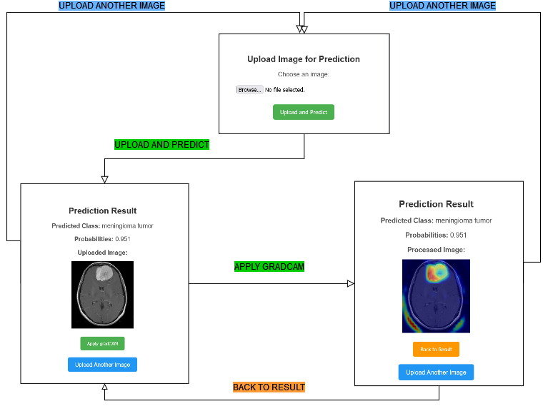

# MRIMaster: AI-supported medical imaging classifier (Ongoing)
 # Table of Contents

[Installation](#Installation)

[Deploy The Best Model Locally](#Deploy-The-Best-Model-Locally)

[Structure](#Structure)

[Domain Problem](#Domain-Problem)

[Experiments to run](#Experiments-to-run)

[Features to add](#Features-to-add)

## Installation

```cmd
docker pull lx1201/mrimaster:v0.0.2
docker run lx1201/mrimaster:v0.0.2
```

```cmd
git clone git@github.com:lixianphys/MRImaster.git
cd mrimaster
python -m venv venv
source venv/bin/activate
pip install -r requirements.txt
python app.py
```


## Deploy The Best Model Locally
Any browser visit http://localhost:8000
<figure style="text-align: center;">
    
</figure>

## Training and Deployment (Local and Cloud Solution)
<figure style="text-align: center;">
    
</figure>

- Setup your credentials in .env file
- `src/train_model.py` is used to train the model locally without monitoring
- `src/train_model_metaflow.py` is used to train the model locally or remotely with monitoring (Under development)
- `fine_tune_mode.py` is used to fine tune the model (e.g.,various hyperparameters)
- Notice to replace the `model_to_deploy.pt` if a better model is trained and examined, consistently deplopying the best model.


## Structure
```
/root
├── app.py
├── model_to_deploy.pt
├── src
├── templates
│   └── index.html
│   └── result.html
│   └── apply_gradcam.html
├── static
├── data
│   └── raw_data/
│   └── processed_data/
│── .env
``` 

## Domain Problem

### MRI Technologies
Magnetic Resonance Imaging (MRI) is a non-invasive imaging technique widely used in diagnosing various medical conditions, especially when it comes to examining soft tissues like the brain. MRI uses strong magnetic fields and radio waves to create detailed images of the body's internal structures. This level of detail is crucial for identifying abnormalities, such as tumors, and has become a cornerstone in the diagnosis and monitoring of brain cancers.

### Three types of tumors (source: Cleveland Clinic website)

- A **glioma** is a tumor that forms when glial cells grow out of control. Normally, these cells support nerves and help your central nervous system work. Gliomas usually grow in the brain, but can also form in the spinal cord. Gliomas are **malignant** (cancerous), but some can be very slow growing.
- A **meningioma** is a tumor that forms in your meninges, which are the layers of tissue that cover your brain and spinal cord. They’re **usually not cancerous** (benign), but can sometimes be cancerous (malignant). Meningiomas are treatable.
- **Pituitary** adenomas are benign tumors on your pituitary gland. They’re **noncancerous**, but they can interfere with normal pituitary function and cause certain health conditions. Healthcare providers treat pituitary adenomas with surgery, medication, radiation or a combination of these therapies.

### Goal
The goal of this project is to automatically classify MRI images of patients' brains into four categories: no tumor, glioma tumor, meningioma tumor, and pituitary tumor. This automation will enable doctors to focus on more critical tasks and make MRI services more affordable, benefiting both patients and the healthcare system.

### Challenges
The images from the Kaggle dataset are well-labeled and divided into four categories for training and evaluation. However, the challenge lies in the fact that tumors can vary in size, and each MRI image represents only a two-dimensional slice of the tumor and surrounding normal brain tissue. For this task, I chose a **convolutional neural network (CNN)** as the classifier, as it is widely used and excels in image classification problems. 

## Experiments to run
- [ ] Augmentation (with or without augmentation)
- [ ] Hyperparameters (learning_rate, batch_size, etc)
- [ ] The number of filters for each conv2d layer

## Features to add
- [ ] Enable switching between models for different classification tasks
- [ ] Build data pipeline for additional datasets beyond Kaggle, e.g., [TCIA API](https://wiki.cancerimagingarchive.net/display/Public/TCIA+Programmatic+Interface+REST+API+Guides)
- [ ] Add object detection for identifying and measuring tumor size
